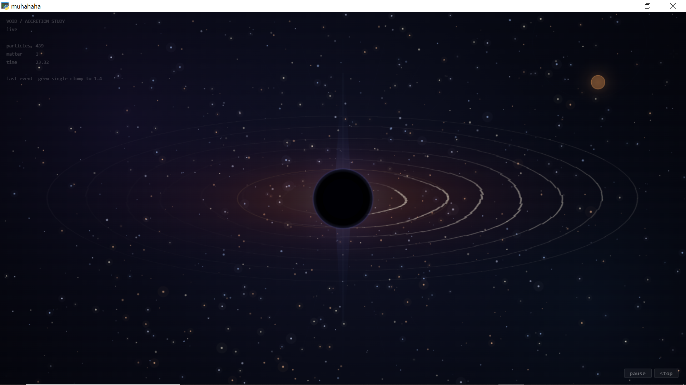

<div align="center">
  
</div>

# Black Hole Simulation

An interactive black hole physics simulation made with **Python, PyWebView, JavaScript, HTML Canvas and CSS**.

This is my **8th attempt** at making this thing. I started with a pretty basic gravity simulation and kept adding more physics, rendering and experiments until it turned into this.

The goal isn't to make a perfect astrophysics simulator. It's to make a simulation where you can actually **see different black-hole effects happening** and understand what the equations are doing.

## What does it simulate?

The simulation currently includes:

* Black-hole gravity
* Black-hole mass growth
* Accretion disk
* Particle orbits
* Gravitational lensing
* Approximate light-ray bending
* Photon sphere
* ISCO
* Black-hole spin
* Simplified frame dragging
* Hawking temperature
* Hawking luminosity
* Tidal-force estimate
* Eddington luminosity estimate
* Quasinormal-mode estimate
* Particle trails
* Jets
* Matter blobs
* Disk temperature/color changes
* Approximate Doppler effects
* Ripples and other visual effects
* A live physics HUD

Some of these are proper physics equations, some are simplified versions, and some are mainly visual approximations.

Basically, I wanted the simulation to look good **without pretending that a Canvas window is secretly running Einstein's entire universe.**

---

## The physics

The simulation uses a mixture of **Newtonian gravity, simplified relativistic corrections and real physics formulas**.

It also has some experimental physics functions that aren't connected to the main simulation yet.

### Schwarzschild radius

The event-horizon radius is calculated using:

```text
rₛ = 2GM / c²
```

where `G` is the gravitational constant, `M` is the black-hole mass and `c` is the speed of light.

The simulation uses its own scaled values for `G` and `c` so everything can run at a reasonable speed.

---

### Orbital velocity

Particles placed into the disk start with approximately:

```text
v = √(GM / r)
```

This is the Newtonian circular-orbit velocity.

A little randomness is added so the disk doesn't look like 400 particles were told to move in formation.

---

### ISCO

For the main Schwarzschild-style disk:

```text
rISCO = 3rₛ
```

Since:

```text
rₛ = 2GM/c²
```

this gives:

```text
rISCO = 6GM/c²
```

There is also a Kerr ISCO calculation in the code for rotating black holes, but it is still experimental and isn't connected to the main disk yet.

---

### Photon sphere

For a non-rotating black hole:

```text
rph = 1.5rₛ
```

or:

```text
rph = 3GM/c²
```

The renderer draws this as a faint ring around the black hole.

---

### Relativistic gravity correction

The normal particle gravity is modified with a simplified correction:

```text
a = GM/r² × (1 + 3v²/c²)
```

This is **not full general relativity**. It's an approximation used to make the particle motion behave less like a normal Newtonian gravity simulation.

---

### Frame dragging

When the black hole has spin, particles receive an additional tangential acceleration.

The simulation currently uses a simplified version:

```text
fd = spin × GM/(r²c) × 50
```

The `× 50` part is a simulation scaling factor.

There is also a more physical frame-dragging angular-velocity function in the code, but it isn't currently driving the main simulation.

---

### Speed limit

Particle speed is calculated with:

```text
v = √(vx² + vy²)
```

and is limited to:

```text
v ≤ 0.99c
```

This keeps the simulation from producing particles moving faster than the speed limit used by the simulation.

Apparently even fake particles need traffic laws.

---

### Hawking temperature

The HUD uses the Hawking temperature equation:

```text
Tₕ = ħc³ / (8πGMkB)
```

The simulation converts its black-hole mass into an approximate physical mass before calculating this value.

The result is displayed in the HUD as `T_h`.

---

### Hawking luminosity

The simulation also calculates the approximate Hawking luminosity:

```text
Lₕ = ħc⁶ / (15360πG²M²)
```

This is displayed as `L_h`.

---

### Tidal force

The HUD estimates the tidal effect around the ISCO using:

```text
tidal = 2GM / rISCO³
```

This is mainly an informational value rather than a complete tidal-force simulation.

---

### Gravitational lensing

The simulation uses an approximate Einstein radius:

```text
RE = √(4GM/c²) × 80
```

The `× 80` is a visual scaling factor.

Light deflection is also approximated with:

```text
α = 4GM/(c²r) × 50
```

The scaling is intentionally exaggerated so the effect can actually be seen.

---

### Lensing magnification

The normalized distance is:

```text
u = r / RE
```

and the simulation uses:

```text
A = (u² + 2) / [u√(u² + 4)]
```

to change the apparent brightness and size of lensed stars.

---

### Light-ray tracing

The simulation traces a small number of approximate light rays around the black hole.

Each ray gets an acceleration roughly based on:

```text
a = 2GM/r²
```

and its velocity is normalized back to the simulation's speed of light.

This is **not a full null-geodesic solver**. It's an approximation that lets the simulation show light bending without turning the computer into a small furnace.

---

### Accretion disk temperature

The disk uses a simplified temperature calculation.

The code first calculates:

```text
x = r / rₛ
```

then:

```text
fac = 3GMṁ / (8πc³)
```

and:

```text
inner = 1 - rₛ/x
```

then:

```text
T = [fac × inner / r³]^(1/4)
```

The main purpose is to give different parts of the disk different temperatures and colors.

It should not be treated as a complete physical accretion-disk model.

---

### Eddington luminosity

The code also contains an Eddington luminosity calculation:

```text
Ledd = 4πGMmpc / σT
```

There is currently a constant typo in the implementation, so the HUD value from this calculation should **not be trusted yet**.

I left this documented instead of pretending it magically works.

---

## Experimental physics

There are also several more advanced functions in the code that I experimented with but haven't fully connected to the visible simulation yet.

These include:

* Kerr horizon
* Kerr ergosphere
* Kerr ISCO
* Frame-dragging angular velocity
* Effective potential
* Relativistic orbit integration
* Stable-orbit searching
* Tortoise coordinates
* Orbital precession
* Gravitational-wave strain
* Disk luminosity

For example, the Kerr ISCO calculation uses the spin-dependent form:

```text
Z1 = 1 + (1-a²)^(1/3)
     [(1+a)^(1/3) + (1-a)^(1/3)]

Z2 = √(3a² + Z1²)

rISCO = 3 + Z2 - √[(3-Z1)(3+Z1+2Z2)]
```

These are currently more like a **physics playground inside the project** than finished parts of the simulation.

---

## Simulation units

The main simulation does not use real SI values for everything.

It uses scaled constants such as:

```text
GRAVITY = 800
C_SIM = 400
```

These are simulation values.

Some HUD calculations separately use real physical constants such as:

```text
G
c
ħ
kB
mp
σT
```

So the project currently mixes **simulation units** with **SI-based informational calculations**.

This is intentional for performance and visibility, but it means the numbers should not be interpreted as a direct physical prediction of a real black hole.

---

# How the project works

The project has two main parts.

Python runs the simulation and calculates the physics.

JavaScript takes the newest simulation state and renders it on an HTML Canvas.

```text
Python physics
      ↓
build_frame()
      ↓
JSON frame data
      ↓
PyWebView
      ↓
JavaScript
      ↓
HTML Canvas
```

The Python simulation runs in its own thread.

The frontend repeatedly asks Python for the newest frame and then renders it using Canvas and `requestAnimationFrame()`.

---

# Project files

```text
.
├── main.py
├── index.html
├── load.js
└── style.css
```

### `main.py`

The main simulation.

It handles:

* physics
* particles
* blobs
* gravity
* black-hole mass
* accretion
* ray tracing
* disk calculations
* jets
* physics HUD values
* communication with PyWebView

### `load.js`

The renderer.

It draws:

* stars
* lensing
* light rays
* accretion disk
* disk glow
* particles
* trails
* jets
* matter blobs
* black hole
* photon sphere
* HUD
* visual effects

### `index.html`

Contains the main Canvas, HUD and controls.

### `style.css`

Controls the appearance of the interface.

---

# Running it

You don't need to understand the code to run the simulation.

## What you need

* Windows
* Python 3
* Internet connection for the first installation
* The four project files

## 1. Download the project

On the GitHub page, click:

**Code → Download ZIP**

Extract the ZIP file.

Make sure these files are together:

```text
main.py
index.html
load.js
style.css
```

## 2. Install Python

Download Python from the official Python website.

During installation, make sure:

```text
☑ Add Python to PATH
```

is enabled.

Then finish the installation.

## 3. Install PyWebView

Open the project folder.

Click the address bar in File Explorer, type:

```text
cmd
```

and press Enter.

Then run:

```text
pip install pywebview
```

If `pip` doesn't work, try:

```text
python -m pip install pywebview
```

## 4. Start the simulation

In the same command window:

```text
python main.py
```

The simulation window should open.

---

# Controls

### Left click

Adds a matter blob where you click.

Normal click:

```text
mass = 1.0
```

### Hold left mouse button

Continuously adds smaller amounts of matter.

```text
mass = 0.4
```

approximately every `70 ms`.

### Mouse wheel

Changes the black-hole spin.

The current range is:

```text
0 ≤ spin ≤ 0.998
```

### Pause

Pauses the main simulation.

### Stop

Stops the simulation thread completely.

Stop cannot currently be undone from the UI.

There is a reset function in Python, but I haven't added a Reset button yet.

---

# Performance

There are a few things keeping the simulation from turning the computer into a space heater.

The project:

* limits the simulation to 2000 particles
* sends only 800 particles to JavaScript
* limits particle trails
* caches the background
* retraces light rays periodically instead of every frame
* limits the simulation timestep
* uses a separate physics thread
* limits ray tracing to 24 rays × 120 steps

The simulation is designed to run on a normal PC rather than requiring a GPU the size of a small building.

---

# Current limitations

This project is still experimental.

The biggest unfinished parts are:

1. Kerr calculations aren't fully connected to the main simulation.
2. The ergosphere isn't currently implemented separately.
3. The Eddington luminosity constant needs fixing.
4. The accretion-disk temperature model is heavily simplified.
5. Blob movement isn't using a proper velocity integration.
6. Jet particles currently receive an extra movement update.
7. Several advanced physics functions are unused.
8. Simulation units and SI calculations are not completely separated.
9. Stop currently has no Reset button.

So no, this is not a research-grade astrophysics simulator.

It's an interactive physics project where I can actually **see the equations doing something**.

---

# Why I made it

I wanted to learn more physics by actually building something instead of just reading equations and hoping my brain would remember them later.
This started as a basic black-hole idea.
Then I kept adding things.
Then I found another physics equation.
Then another.
And somehow it became my **8th attempt at a black-hole simulation.**
Some parts work properly, some are approximations, and some are experiments waiting to be connected.
That's basically the project.


#thanks to chatgpt to help me learn physics and many more

